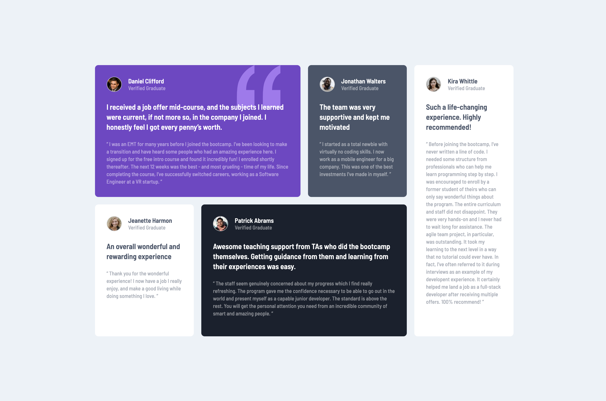

# Frontend Mentor - Testimonials grid section solution

This is a solution to the [Testimonials grid section challenge on Frontend Mentor](https://www.frontendmentor.io/challenges/testimonials-grid-section-Nnw6J7Un7). Frontend Mentor challenges help you improve your coding skills by building realistic projects. 

### The challenge

Users should be able to:

- View the optimal layout for the site depending on their device's screen size

### Screenshot

### Links

- Solution URL: [Add solution URL here](https://your-solution-url.com)
- Live Site URL: [URL](https://truongnhatanh7.github.io/FrontendMentor_Testimonial_Grid/)

### Built with
- HTML, CSS

## Author

- Credence aka Truong Nhat Anh
- Frontend Mentor - [@truongnhatanh7](https://www.frontendmentor.io/profile/truongnhatanh7)

